

### NHẬT KÝ SỬ DỤNG AI & PHẢN TƯ (AI LOG & REFLECTION)
> **Ngày cập nhập:** 01/10/2026
> **Nhóm thực hiện:** DASA_605
---
*Nhóm em đã sử dụng AI để tạo ra form mẫu, sau đó chỉnh sửa lại theo đúng những gì nhóm chúng em thực hiện*
## I. Mục tiêu sử dụng AI
Trong quá trình triển khai và hoàn thiện đồ án, nhóm của chúng em đã sử dụng trí tuệ nhân tạo AI như một trợ thủ đắc lực nhằm đạt được các mục tiêu cụ thể sau:
1. Đề xuất cấu trúc dữ liệu phù hợp và giải thuật tối ưu để tối đa hóa hiệu suất của dự án, đảm bảo thông tin được tổ chức một cách hệ thống và truy cập nhanh chóng.
2. Cung cấp hỗ trợ tìm kiếm và phân tích lỗi (debug), đồng thời giải thích rõ ràng các thông báo lỗi từ hệ thống, giúp tránh những hiểu nhầm không đáng có và nhanh chóng khắc phục sự cố trong quá trình phát triển mã nguồn.
3. Nâng cao khả năng tối ưu hóa đoạn mã, giúp không chỉ cải thiện hiệu suất thực thi mà còn làm cho mã nguồn trở nên dễ đọc hơn, linh hoạt hơn trong việc sửa đổi về sau.

*Nhóm cam kết không sử dụng AI để sinh ra toàn bộ mã nguồn chính, mọi đoạn code do AI gợi ý đều được thành viên trong nhóm kiểm tra, chạy thử và hiểu rõ logic trước khi áp dụng.*

## II. Nhật ký chi tiết (AI Usage Log)

| STT | Ngày | Thành viên | File/Module | Mục đích | Tóm tắt Prompt | Kết quả & Đánh giá |
|:---:|:---:|:---|:---|:---|:---|:---|
| 1 | 22/09 | Hoàng |  | Tạo và cập nhật cấu trúc Project ban đầu | Hãy giúp tôi tạo ra một cấu trúc Project theo Nội Dung hướng dẫn dưới đây | AI trả ra là một cấu trúc Project có sự phù hợp với những gì nhóm đã hướng đến |
| 2 | 23/09 | Quốc Anh | PriorityQueue.h | Kiểm tra lỗi chính tả và logic code | AI đọc file và chạy test | AI trả ra những lỗi chính tả và logic xuất hiện trong file |
| 3 | 23/09 | Hoàng | DoubleLinkedList | Tìm hướng giải quyết | Tôi muốn tạo một structure nhưng lại có 2 service dùng chung khác nhưng dữ liệu -> gợi ý | Gợi ý 2 service lưu 2 loại object khác nhau thì nên dùng template & em đã áp dụng và thấy hiệu quả |
| 4 | 25/09 | Nhật | HashTable | Tìm hướng giải quyết | Tôi muốn tạo một structure và tìm cách kết nối các service dùng chung khác nhau | Giải quyết xung đột giữa service HashTable và DoubleLinkedList |
| 5 | 27/09 | Minh | UndoService | Tìm hướng giải quyết | Với input có cấu trúc thế này thì hướng đi nào phù hợp để tách được 2 phần vào 2 dữ liệu khác nhau | Đưa ra hướng đi phù hợp kèm theo đó giải quyết luôn cả vấn đề tách command và target |
| 6 | 27/09 | Minh | UndoService | Tìm hướng giải quyết | Với định dạng YYYY-MM-DD HH:MM thì hướng nào để xử lí chuỗi và so sánh với chuỗi khác | Đưa ra thư viện để xử lí chuỗi sau đó so sánh với nhau để lấy được khoảng cách thời gian |
| 7 | 30/09 | Hoàng | DoubleLinkedList | Debug | Hiện tại đoạn mã nguồn của tôi như sau: .... tại sao khi chạy test nó lại báo lỗi ... | Đã giải quyết được vấn đề, kết quả nhận được khá là mới mẻ trong việc dùng operator== |
| 8 | 30/09 | Hiếu | test_mc1 | Sinh bộ testcase kiểm thử | Hãy giúp tôi sinh các testcase cho đầy đủ các trường hợp TicketService | Sinh ra danh sách testcase đầy đủ cho các trường hợp hợp lệ, hết hạn, đã dùng, không tìm thấy và sai định dạng |
| 9 | 02/10 | Nhật | HashTable | Debug | Hãy kiểm tra giúp tôi HashTable vì sao vẫn còn xung đột với DoublyLinkedList | Cần phải thêm operator cho giống của DoubleLinkedList (DLL) để cho HashTable hiểu được cùng kiểu dữ liệu với DLL |
| 10 | 02/10 | Nhật | test_showtime | Tìm hướng giải quyết | Dựa trên 6 tiêu chí để tìm kiếm một suất phù hợp, hãy giúp tôi viết code đúng yêu cầu, nếu sai thì nhảy ra ngay | Đúng như yêu cầu, kiểm tra lần lượt từng tiêu chí, nếu sai có thể fix nhanh chóng |
| 11 | 03/10 | Hoàng | design.md | Vẽ sơ đồ kiến trúc hệ thống | Hãy vẽ sơ đồ kiến trúc hệ thống theo mô hình ba tầng theo mô tả sau: .... Yêu cầu hình vẽ: ... | AI trả ra là một hình vẽ sơ đồ kiến trúc hệ thống, đánh giá thiết kế đúng theo yêu cầu |
| 12 | 03/10 | Hoàng | Giaodien | Xây dựng một giao diện | Tôi sẽ cung cấp source code C++ hiện tại của project. Hãy đọc và phân tích source code trước, sau đó xây dựng một giao diện frontend phù hợp với chính các chức năng mà code hiện tại đang có. | AI đọc hiểu code C++, liệt kê danh sách tính năng và vẽ ra giao diện |

## III. Phản tư & Đánh giá (Reflection)

### 1. Phạm Minh Hoàng
Điểm tốt: 
- Chạy đúng và rõ ràng: Code xử lý đúng logic chính, phân chia các phần hợp lý và đặt tên biến, tên hàm dễ hiểu.
  
Điểm chưa tốt:
- Code và hiệu năng: vẫn còn lặp code (cần gộp thành hàm chung), một vài chỗ chạy chưa tối ưu và chưa giải phóng bộ nhớ/tài nguyên gọn gàng. 
- Gọn gàng: nhiều hàm còn quá dài cần tách nhỏ ra, đôi khi lại có những mã nguồn khá là ngắn gọn nằm ngoài khả năng hiểu biết của bản thân khiến cho việc phải tạo lệnh nhờ xử lí lại. 

### 2. Phạm Hồng Tiến Minh
Điểm tốt:
- Code rõ ràng chạy, chạy đúng LIFO, quản lí bộ nhớ và xử lý logic của undo hợp lí

Điểm chưa tốt:
- Xử lí lỗi và khả năng mở rộng của code còn hạn chế, UndoService phụ thuộc nhiều vào cout và các operation đang được xử lý cố định bằng if

### 3. Trương Hoàng Minh Nhật
Điểm tốt:
- Code chạy ổn định, đúng như cách mô tả, các hàm đều được định nghĩa để có thể dễ hiểu, tên hàm và biến đều được đặt để dễ mừng tượng.

Điểm chưa tốt:
- Khi viết code còn phải fix rất nhiều mới được bản hoàn chỉnh.
- Sử dụng thư viện khá nhiều, cần cải thiện thêm.
- Code còn bừa bộn chưa gọn gàng.
- Khả năng hiểu biết còn kém và nhờ AI hỗ trợ phần này khá nhiều.

### 4. Lê Bùi Minh Hiếu
Điểm tốt:
- Code đã chạy đúng các yêu cầu, các hàm đã được định nghĩa cụ thể dễ hiểu, đảm bảo tra cứu và kiểm tra với thời gian tối thiểu.

Điểm chưa tốt:
- Các hàm để kiểm tra thông tin thời gian phải tính từ năm 1 rồi mới có thể so sánh.
- Chưa mở ra được khả năng phát triển code, bản thân đã sử dụng nhiều các hàm thư viện.

### 5.

## IV. Minh chứng (Evidence)
*Hình ảnh nhóm sử dụng AI để gỡ lỗi (Debug) trong quá trình làm việc:*
- Minh chứng 1:
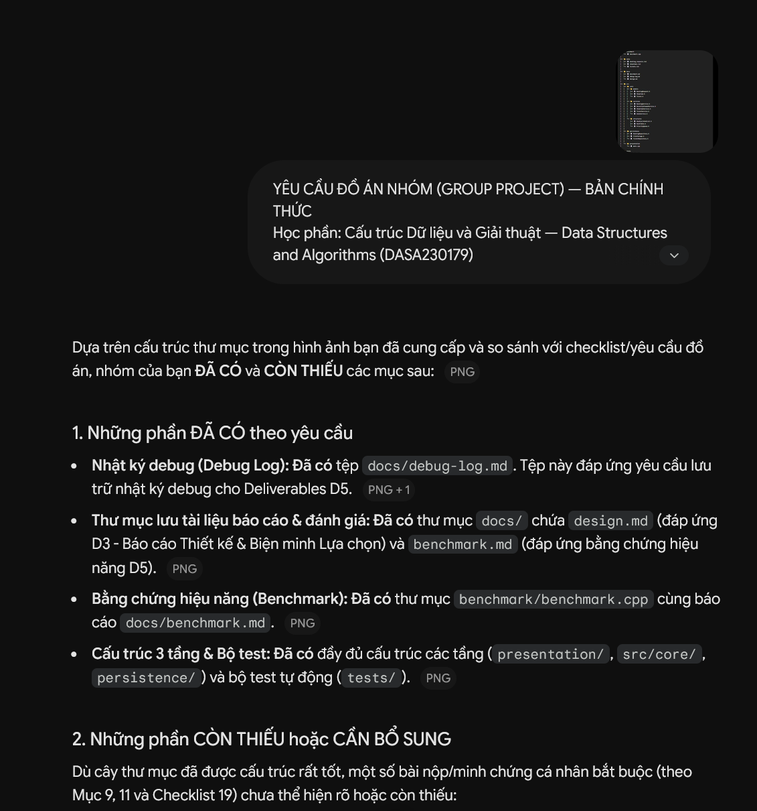
- Minh chứng 2:
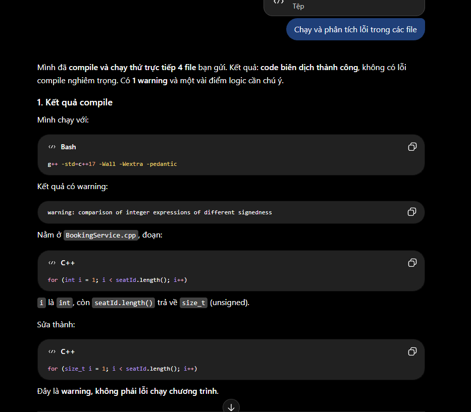
- Minh chứng 3:
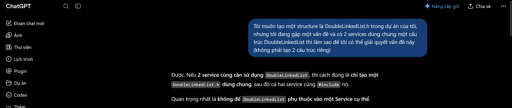
- Minh chứng 4:

- Minh chứng 5:
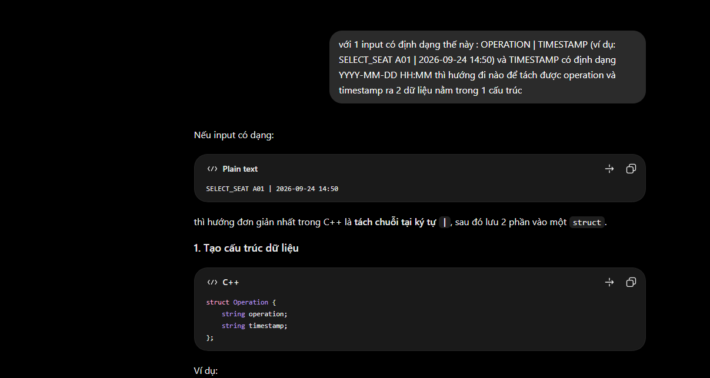
- Minh chứng 6:
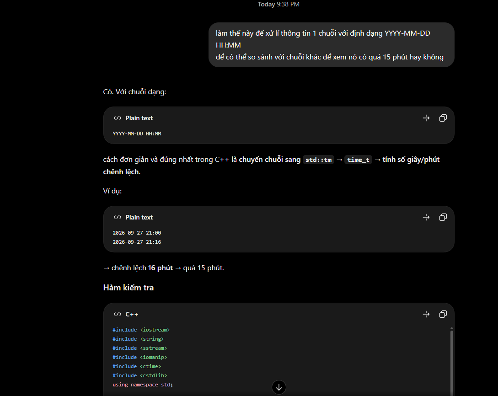
- Minh chứng 7:
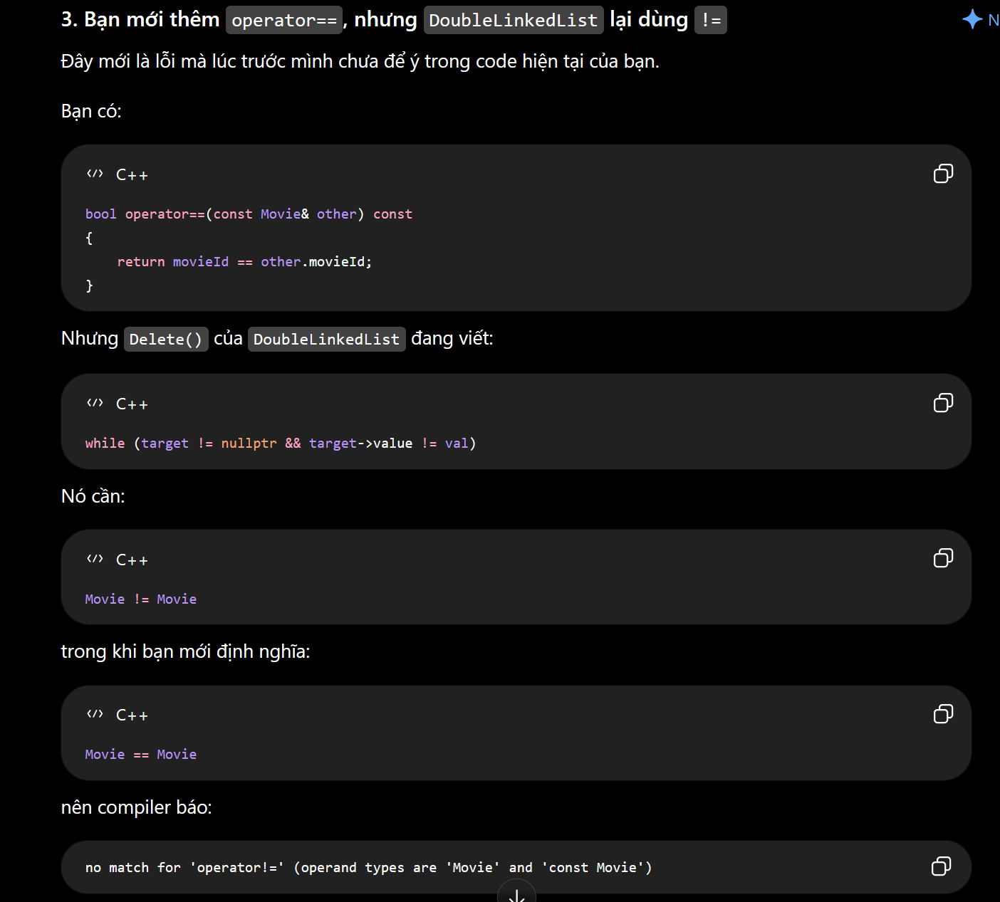
- Minh chứng 8:
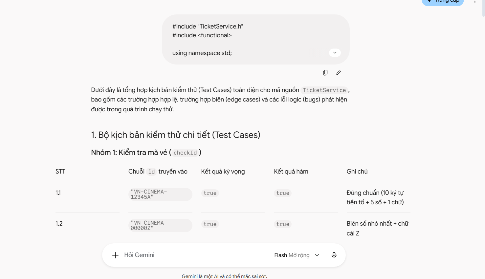
- Minh chứng 9:
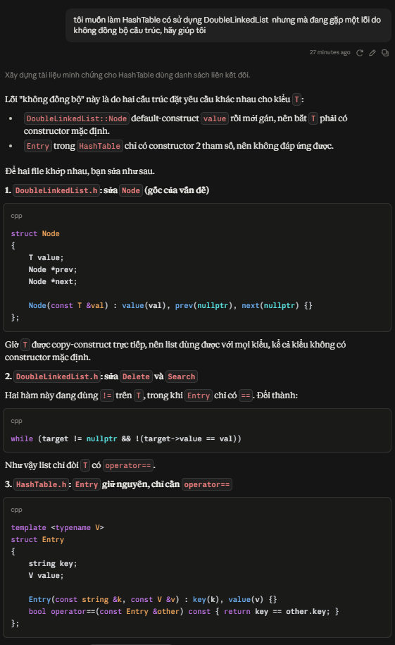
- Minh chứng 10:
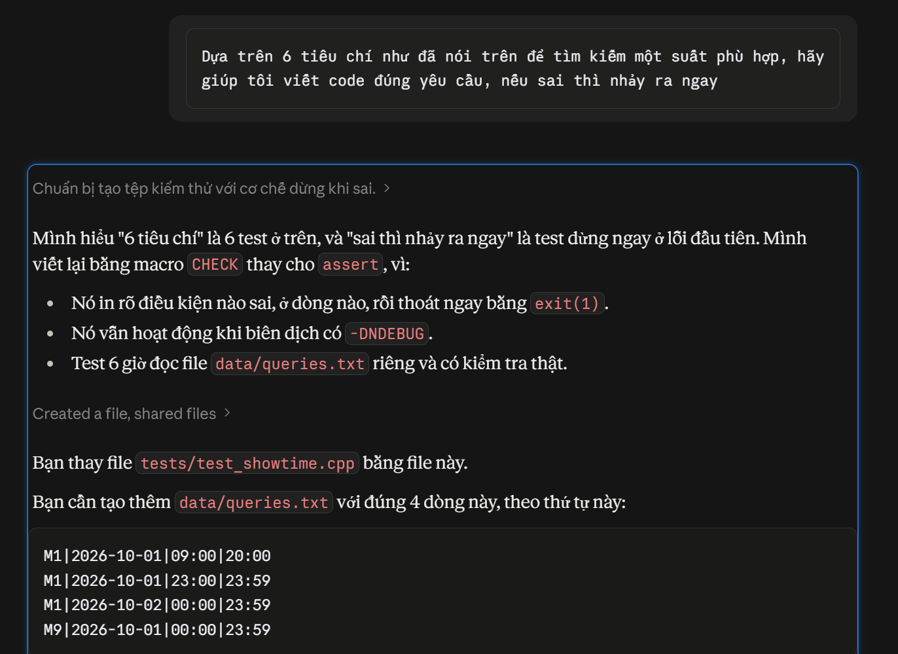
- Minh chứng 11:
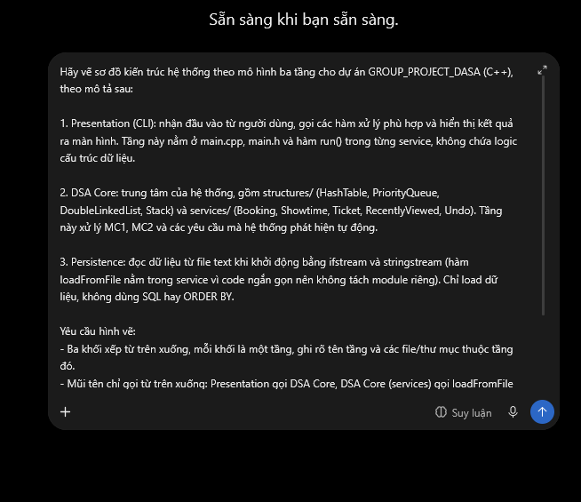
- Minh chứng 12:
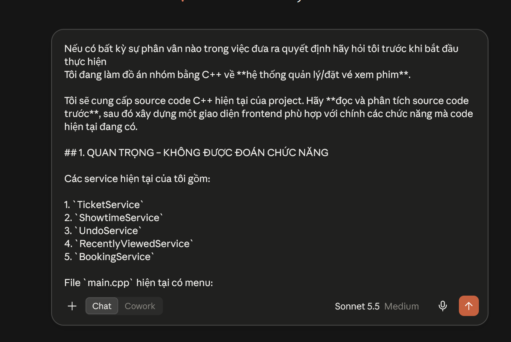