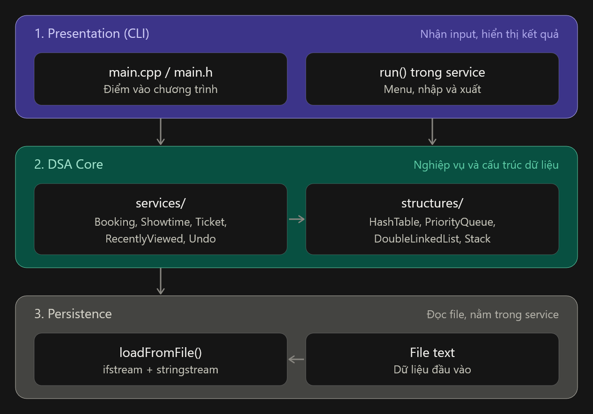

# BÁO CÁO THIẾT KẾ & BIỆN MINH LỰA CHỌN CẤU TRÚC DỮ LIỆU

**Mã lớp HP:** 261DASA230179_06  
**Đồ án:** Hệ thống đặt vé sự kiện / Rạp chiếu phim  
---
*Nhóm của chúng em đã sử dụng AI để tạo ra biểu mẫu ban đầu, sau đó thực hiện chỉnh sửa chỉnh sửa sao cho sát với những gì nhóm đã triển khai.*
---

## I. KIẾN TRÚC HỆ THỐNG

Hệ thống mà chúng em đang phát triển được thiết kế theo mô hình ba tầng, mặc dù cấu trúc dự án chỉ ở quy mô nhỏ và mã nguồn chưa đạt đến mức độ phức tạp cao. Để duy trì sự đơn giản và dễ quản lý, nhóm phát triển đã quyết định không tách từng tầng riêng lẻ thành các thư mục riêng biệt, thay vào đó, các tầng được phân chia dựa trên vai trò chức năng của chúng. Một số hàm từ tầng Presentation và Persistence được tích hợp vào cùng với lớp service để tăng cường hiệu suất và khả năng truy cập.

**1. Presentation (CLI)**
Trong tầng Presentation, có nhiệm vụ chủ yếu là tiếp nhận dữ liệu đầu vào từ phía người dùng, thực hiện các lệnh xử lý phù hợp và sau đó hiển thị kết quả trở lại trên màn hình. Tầng này được triển khai trực tiếp trong các tệp mã nguồn main.cpp, main.h cũng như trong hàm run() của từng dịch vụ cụ thể như TicketService::run(). Tại đây, phần menu và các bước nhập xuất được cấu trúc kỹ lưỡng. Cần lưu ý rằng không có logic nào liên quan đến cấu trúc dữ liệu phức tạp được xử lý trực tiếp trong tầng này; thay vào đó, các hoạt động như tìm kiếm hoặc xử lý vé sẽ gọi đến các hàm chuyên dụng trong DSA Core.

**2. DSA Core**
Tầng này đóng vai trò như trái tim của hệ thống, với hai phần chính yếu:

- structures/: chứa các cấu trúc dữ liệu tự định nghĩa như `HashTable`, `PriorityQueue`, `DoubleLinkedList`, và `Stack`. Những cấu trúc này cung cấp nền tảng cho việc lưu trữ và xử lý dữ liệu một cách hiệu quả.
- services/: áp dụng các cấu trúc dữ liệu từ phần trên để xử lý các yêu cầu từ MC1, MC2 cũng như các nhu cầu khác mà chúng em tự phát hiện.

**3. Persistence**
Tầng Persistence đảm nhiệm việc đọc dữ liệu từ các tệp văn bản ngay khi hệ thống bắt đầu khởi động. Sử dụng các công cụ như ifstream và stringstream, dữ liệu được phân tích từ từng dòng và chuyển thành các đối tượng được xác định trước trong thư mục models/, sau đó mỗi đối tượng được nạp vào các cấu trúc dữ liệu thích hợp. Do đặc thù về quy mô nhỏ của dự án, những chức năng đọc file, ví dụ như `loadFromFile`, được đặt trực tiếp trong *từng dịch vụ tương ứng* để tối ưu hóa quy trình, thay vì tách riêng thành một module độc lập. Tầng này chỉ tập trung vào việc đọc dữ liệu và không sử dụng các câu lệnh SQL hay các phương thức sắp xếp như ORDER BY để thực hiện truy vấn.

---

## II. PHÂN TÍCH & CHỌN CẤU TRÚC DỮ LIỆU

### 1. MC1 — Tra cứu vé theo Booking ID
**Vấn đề cần giải quyết:** Khi nhân viên quét mã vé, hệ thống cần trả lại thông tin liên quan trong thời gian ngắn nhất có thể, ngay cả khi dữ liệu lên tới hàng triệu vé.

**Phân tích:**
- Thao tác chính ở đây là tìm kiếm chính xác thông qua `booking_id`.
- Không cần sắp xếp thứ tự hoặc duyệt tuần tự.
- Có tần suất đọc cao, còn ghi thấp.
- Mục tiêu hiệu suất: trung bình O(1).

**Lựa chọn:** Sử dụng `HashTable.h` + `DoubleLinkedList` tự cài đặt để đạt được mục tiêu.

**Đánh đổi:** Có khả năng va chạm dẫn đến trường hợp xấu nhất là O(n). Nếu sau này có nhu cầu liệt kê vé theo thứ tự thời gian thì Hash Table không đáp ứng được và cần thêm cấu trúc khác.

---

### 2. MC2 — Xử lý yêu cầu đặt ghế theo thứ tự ưu tiên
**Bài toán:** Vấn đề cần giải quyết:** Đối mặt với tình huống nhiều khách hàng cùng đặt vé một lúc, hệ thống phải xử lý được yêu cầu theo ưu tiên dựa trên thời gian. Trong trường hợp thời gian giống nhau, cần ưu tiên dựa trên `request_id` nhỏ hơn.

**Phân tích:**
- Thao tác chính cần tập trung là lấy ra phần tử có `timestamp` nhỏ nhất.
- Yêu cầu so sánh hai yếu tố: `timestamp`, sau đó là `request_id`.
- Dữ liệu đầu vào không được sắp xếp.
- Mục tiêu hiệu suất: O(log n) cho các thao tác thêm và lấy ra.

**Lựa chọn:** Áp dụng `PriorityQueue.h` (Min-Heap) tự cài đặt.

**Đánh đổi:** Sử dụng Heap cho phép lấy phần tử nhỏ nhất trong thời gian O(log n). Nhược điểm là muốn duyệt toàn bộ hàng đợi theo thứ tự phải lần lượt pop rồi push lại, điều này chấp nhận được vì chỉ cần lấy ra và xử lý tuần tự từng yêu cầu.

---

### 3. Yêu cầu tự phát hiện 1 — Hoàn tác thao tác (Undo)
**Vấn đề cần giải quyết:** Cần cho phép khách hàng hoàn tác khi chọn nhầm ghế hoặc combo, với giới hạn tối đa là 10 bước và thời gian hết hạn là 15 phút.

**Phân tích:**
- Thao tác mới nhất được hoàn tác trước (LIFO).
- Giới hạn kích thước là 10 phần tử.
- Cần kiểm tra thời gian để loại bỏ thao tác cũ.

**Lựa chọn:** Sử dụng `Stack.h` (SingleLinkedList) đóng vai trò như một Stack, thực hiện thêm vào đầu và lấy ra từ đầu.

**Đánh đổi:** `Stack` cho phép thêm vào và xóa khỏi nhanh chóng ở đầu danh sách trong O(1). Để giới hạn 10 phần tử, chỉ cần kiểm tra kích thước trước khi thêm. Khi cần kiểm tra thời gian hết hạn, so sánh dấu thời gian khi xóa.

---

### 4. Yêu cầu tự phát hiện 2 — Danh sách phim vừa xem gần đây
**Vấn đề cần giải quyết:** Lưu tối đa 5 phim gần nhất. Khi xem phim mới, phim được đẩy lên đầu danh sách. Nếu phim đã có trong danh sách, di chuyển lên vị trí đầu. Nếu danh sách đầy, xóa phim ở cuối.

**Phân tích:**
- Kích thước danh sách rất nhỏ (tối đa phần tử).
- Thao tác chính bao gồm: thêm phần tử vào đầu, xóa phần tử ở cuối, và di chuyển một phần tử lên đầu.
- Cần rà soát phim đã tồn tại nhanh chóng.

**Lựa chọn:** Sử dụng `DoubleLinkedList.h`.

**Đánh đổi:** DoubleLinkedList cho phép thêm, xóa và di chuyển phần tử trong O(1), nhưng cần sử dụng thêm bộ nhớ phụ trợ O(n).

---

### 5. Yêu cầu tự phát hiện 3 — Lọc suất chiếu theo khung giờ
**Vấn đề cần giải quyết:** Khách hàng muốn xem phim trong khoảng thời gian [T1, T2], và hệ thống cần trả về danh sách suất chiếu đã được sắp xếp theo thời gian bắt đầu (StartTime).

**Phân tích:**
- Truy vấn gồm hai bước: tra nhóm suất chiếu theo (MovieID, Date), sau đó lọc theo khoảng StartTime trong nhóm.
- Bước tra nhóm là tìm theo khóa chính xác, không cần thứ tự.
- Bước lọc cần dữ liệu đã sắp xếp để tìm nhanh điểm bắt đầu và dừng khi vượt quá T2.
- Dữ liệu ít thay đổi, đọc nhiều, nên chỉ sắp xếp khi có thay đổi.
  
**Lựa chọn:** `HashTable` kết hợp mảng động xử lý colision bằng separate chaining

**Đánh đổi:**  `HashTable` cho phép tra cứu phim trong O(1) và lọc theo thời gian với tốc độ O(logk + m) nhưng không có thứ tự nên phải kèm mảng sắp xếp, và mỗi lần thêm suất mới thì nhóm phải sắp xếp lại với O(klogk) ở lần tìm kế tiếp.

---

## III. YÊU CẦU XUNG ĐỘT

**Xung đột:** MC1 cần tra cứu nhanh theo ID (Hash Table + DoubleLinkedList), MC2 và yêu cầu lọc suất chiếu cần duyệt theo thứ tự (Priority Queue). Không có cấu trúc nào làm tốt cả hai.

**Giải pháp:** Kết hợp các cấu trúc dữ liệu:

- `HashTable` đảm nhận vai trò chỉ mục chính để tra cứu vé theo `booking_id`.
- `PriorityQueue` giữ vai trò xử lý hàng đợi đặt ghế.
- `DoubleLinkedList` 
- `Stack` (SingleLinkedList) giữ vai trò quản lý lịch sử thao tác (Undo) và danh sách phim gần đây. Khi thêm hoặc xóa dữ liệu, cập nhật đồng bộ các cấu trúc liên quan.

**Chấp nhận:** Tăng cường sử dụng bộ nhớ và thời gian ghi dữ liệu. Bù lại, thao tác đọc sẽ nhanh hơn.

---

## IV. PHƯƠNG ÁN BỊ LOẠI

| Phương án | Lý do loại |
|:---|:---|
| Mảng động cho MC1 | Tìm kiếm tuyến tính O(n), không hiệu quả với hàng triệu vé. |
| Hash Table cho MC2 | Không thể lấy được phần tử nhỏ nhất một cách hiệu quả. |
| SQLite xử lý truy vấn | Vi phạm yêu cầu kiến trúc, tầng Persistence chỉ được load/save. |
| Mảng cho Recently Viewed | Chèn/xóa/di chuyển tốn O(n), không đáp ứng yêu cầu nhanh. |

---

## V. SƠ ĐỒ KIẾN TRÚC
  

